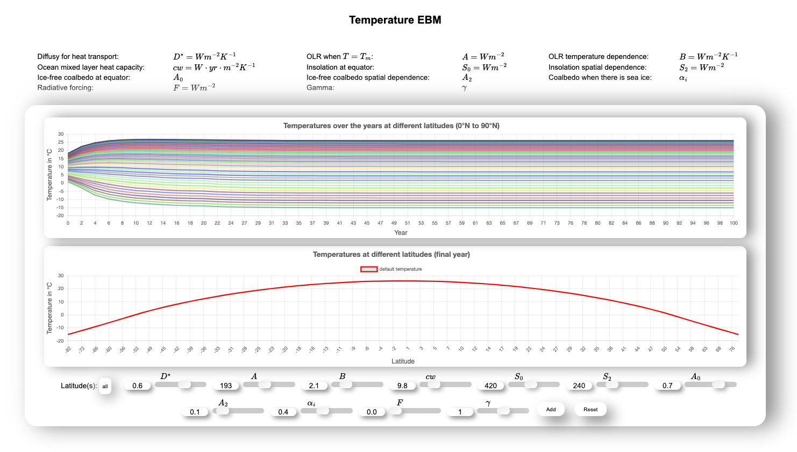
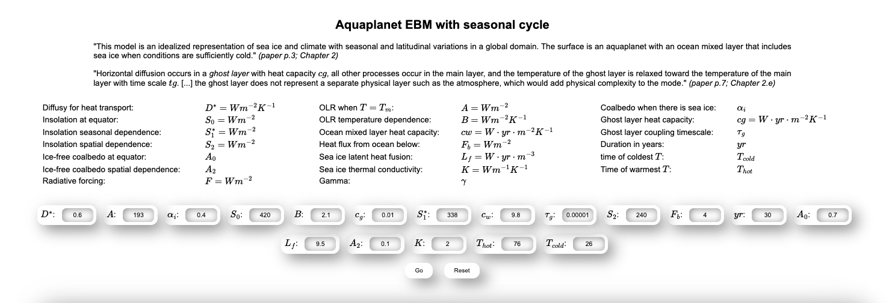

# [Energy Balance Models - Website](https://btschwertfeger.github.io/Energy-Balance-Models-Website/)

This website includes a simple temperature and a more complex aqua-planet energy balance model. These can be run, then the results are visualized.

The goal is to visually represent complex interrelationships by means of simple inputs without programming experience.

## Availability

- [https://btschwertfeger.github.io/Energy-Balance-Models-Website/](https://btschwertfeger.github.io/Energy-Balance-Models-Website/)
- [https://www.awi.de/ ....](https://www.awi.de/fileadmin/user_upload/AWI/Forschung/Klimawissenschaft/Dynamik_des_Palaeoklimas/EnergyBalanceModels/index.html)
